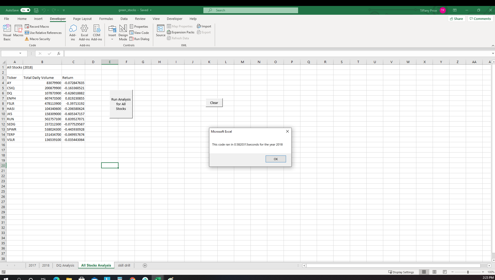

# VBA Challenge - Refactoring
## Overview of Project
### Purpose of Analysis
A friend, Steve, is researching stocks on behalf of his parents to aid them in their decision making process for investing. In order to help him analyze the entire stock market over the last few years, the original code written during Module 2 needs to be refactored to increase the running speed of the VBA script. Refactoring is a way to make code more efficient by either taking fewer steps, by using less memory, or by improving the logic of the code.
## Results
To refactor the code, arrays were created for tickers, tickerVolumes, tickerStartingPrices, and tickerEndingPrices.  The following index and arrays were used:
    
    Dim tickerIndex As Single
    tickerIndex = 0
    
    Dim tickerVolumes(12) As Long
    Dim tickerStartingPrices(12) As Single
    Dim tickerEndingPrices(12) As Single
     
The tickerIndex was used to access the stock ticker index for the tickers, tickerVolumes, tickerStartingPrices, and tickerEndingPrices arrays. Finally, the script was directed to loop through the stock data, to provide the Ticker, Total Daily Volume, and Return results.  The following stocks were analyzed:
    
    tickers(0) = "AY"
    tickers(1) = "CSIQ"
    tickers(2) = "DQ"
    tickers(3) = "ENPH"
    tickers(4) = "FSLR"
    tickers(5) = "HASI"
    tickers(6) = "JKS"
    tickers(7) = "RUN"
    tickers(8) = "SEDG"
    tickers(9) = "SPWR"
    tickers(10) = "TERP"
    tickers(11) = "VSLR"
### Stock Performance
The analysis was run on twelve pre-determined stocks for both 2017 and 2018.  Based on the results, all but one of the stocks in 2017 provided positive returns; some were even over 100%! [2017 Stock Performance](Resources/2017_Stock_Performance.png) The results in 2018 proved to be vastly different.  Only two of the twelve stocks produced a positive return for the year. [2018 Stock Performance](Resources/2018_Stock_Performance.png)
### Execution Times
#### 2017
The execution times between the original and refactored script were vastly different.  The run time using the refactored code for 2017 was 0.19 seconds, compared to 0.57 seconds using the original code.    
#### 2018
Similarly, the run time using the refactored code for 2018 was 0.18 seconds, versus 0.58 seconds using the original code.  
## Summary
There are both advantages and disadvantages of refactoring code, which were discovered during the completion of this project.
### Advantages/disadvantages of refactoring code
Some advantages of refactoring code include fewer lines of code and/or fewer variables needed, which in turn makes the code less prone to errors and more reusable. However, there could be some disadvantages as well. I found that the refactoring of the original VBA script created more work, made the code more complex, and therefore made the code more prone to errors.  It took a bit of time to adjust the original code to account for the new arrays.  However, once the refactoring was complete, the run time significantly decreased for both years of analysis, which is definitely an advantage of the process.
